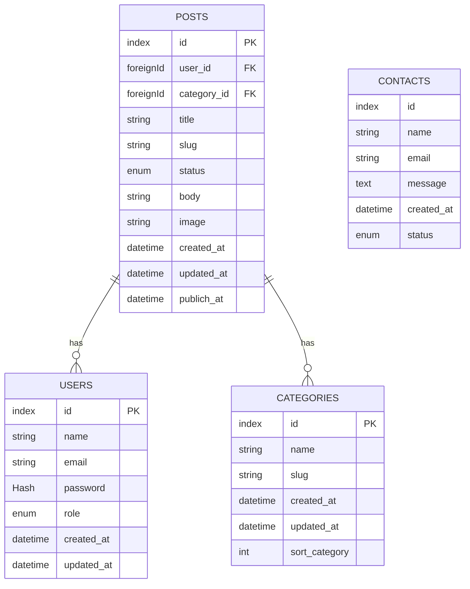

```mermaid
erDiagram
    POSTS ||--o{ USERS : has
    USERS {
        index id PK
        string name
        string email
        Hash password
        enum role
        datetime created_at
        datetime updated_at
    }
    POSTS {
        index id PK
        foreignId user_id FK
        foreignId category_id FK
        string title
        string slug
        enum status
        string body
        string image
        datetime created_at
        datetime updated_at
        datetime publich_at
    }
    POSTS || --o{ CATEGORIES : has
    CATEGORIES {
        index id PK
        string name
        string slug
        datetime created_at
        datetime updated_at
        int sort_category
    }
    CONTACTS {
        index id
        string name
        string email
        text message
        datetime created_at
        enum status
    }

```
